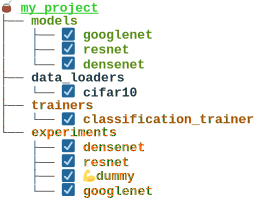
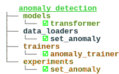

<h1 style="color:green"><span style="color:green">Maté 🧉</span></h1>

Mate is a tool designed to improve reproducibility and facilitate development in deep learning. It is a command line tool that offers a variety of features to help you manage your project, including:

- Validating the structure of your project
- Visualizing/summarizing your project
- Summarizing your results
- Running/testing your experiments.

In addition, any project developed with Mate on a public repository gets automatically listed on [MateHub](https://salamanderxing.github.io/mate/). This website is a browser for finding and reusing components created by others (or yourself).

Mate is compatible is any python deep learning framework (such as JAX, PyTorch, and TensorFlow) since it leverages Python features.

<!-- 
Maté is a comprehensive framework for deep learning projects that aims to streamline the development process and make it easier for developers to create high-quality projects. It includes features such as a training manager to help you set up, run, and monitor your models, as well as a package manager to manage dependencies and share code with others.


Maté also includes a [MateHub](https://salamanderxing.github.io/mate/), a store of all available modules that can be easily accessed and incorporated into a project. With support for multiple deep learning frameworks including PyTorch, TensorFlow, and Jax, Maté is flexible and can be used with the tools you already know and love.


Maté standardizes project structure to make it easy to understand and work with, while still allowing for flexibility and customization. And with its intuitive design, Maté is easy to learn and use, saving you time and effort in the development process. Make your deep learning projects more efficient and effective with Maté.
-->

<p align="center">
  
</p>

## Installation 🔌
At the moment Maté is only supported on MacOS and Linux, but soon also windows.

```bash
git clone https://github.com/SalamanderXing/mate
cd mate
pip install -e .
```


## Examples

### PyTorch Lightning

- [MNIST Classifier](https://github.com/SalamanderXing/pytorch-lightning-mnist)

### JAX (with Flax)
[JAX](https://github.com/google/jax) is the (relatively) new framework by Google. That uses just-in-time-compilation to improve performance of your neural network.
These projects are based on this [amazing repo](https://github.com/phlippe/uvadlc_notebooks/tree/master/docs/tutorial_notebooks/JAX).

- [CIFAR10 Autoecoder](https://github.com/SalamanderXing/jax-ae)
- [Graph Neural Networks](https://github.com/SalamanderXing/jax-gnn)
- [Normalizing Flow](https://github.com/SalamanderXing/jax-normalizing-flow)
- [Inception, ResNet, DenseNet](https://github.com/SalamanderXing/jax-inception-resnet-densenet)
- [Autoregressive Image Modeling](https://github.com/SalamanderXing/jax-autoregressive-image-modeling)
- [Transformers for text classification](https://github.com/SalamanderXing/jax-transformers)
- [Transformers for anomaly detection](https://github.com/SalamanderXing/jax-anomaly-detection)


## Quick Start ⚡

First clone a mate project, for example: 
```bash
git clone https://github.com/SalamanderXing/pytorch-lightning-mnist
```
Then go to the project directory:
```bash
cd mnist_classifier
```
Then run:
```
mate summary
```
This will give you an overview of your projec and your componens. It also tells you where your components have issues. In this case, (hopefully) you will see something like this:
<p align="center" style="margin:0; padding:0;">
  
</p>


****

**Train a model**

```bash
mate train my_experiment
```

**Evaluate a model**

```bash
mate test my_experiment
```

**Run a model**

More features coming soon!

## Comparison to familiar tools

- *Weights & Biases* wandb is a logger and allows model weights sharing as well
- *Tensorboard* This is a logger and can be integrated into mate
- *[Monai](https://github.com/Project-MONAI/MONAI)*
- *[Ivy](https://github.com/unifyai/ivy)*
- *[THINGSvision](https://github.com/ViCCo-Group/thingsvision)*


## FAQ
**Q: Does Maté work with colab?**

**A**: Yes! Maté works with colab as any Maté project is exportable to a juypter notebook.

## Contact 🤝 

For questions please contact:

g.zani(at)uva.nl
