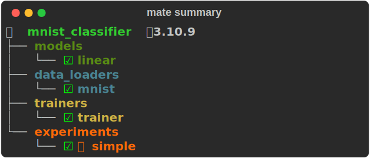
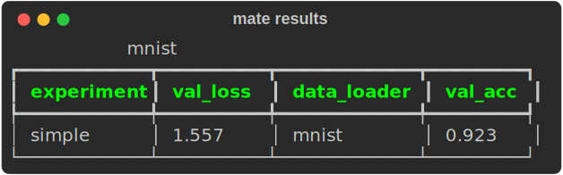

# Maté 🧉

Mate is a tool designed to improve reproducibility and facilitate development in
deep learning. It is a command line tool that offers a variety of features to
help you manage your project, including

- Validating the structure of your project
- Visualizing/summarizing your project
- Remote execution of experiments
- Summarizing your results
- Running/testing your experiments.
- Managment of Python virtual environment

  ⚠️  Mate is currently under heavy development. Contact me for more details.

<!---->
<!-- It also creates a universal template for deep learning projects. -->
<!-- In addition, any project developed with Mate on a public repository gets automatically listed on MateHub. This website is a browser for finding and reusing components created by others (or yourself). -->
<!-- Mate is compatible with any python deep learning framework, such as PyTorch, JAX, and TensorFlow/Keras, since it leverages Python features. -->
<!---->
<!---->
<!-- ## [documentation](https://salamanderxing.github.io/mate) -->
<!---->
<!-- Mate is developed in collaboration with the University of Amsterdam. -->
<!---->
<!-- --- -->
<!---->
<!-- ## Installation 🔌 -->
<!---->
<!-- 
 -->
<!--      -->
<!-- 
 -->
<!---->
<!-- --- -->
<!---->
<!-- ## Example Projects -->
<!---->
<!---->
<!-- ### PyTorch Lightning -->
<!---->
<!-- - [MNIST Classifier](https://github.com/SalamanderXing/pytorch-lightning-mnist) -->
<!---->
<!-- ### JAX (with Flax) -->
<!-- [JAX](https://github.com/google/jax) is the (relatively) new framework by Google. That uses just-in-time compilation to improve performance of your neural network. -->
<!-- These projects are based on this [amazing repo](https://github.com/phlippe/uvadlc_notebooks/tree/master/docs/tutorial_notebooks/JAX). -->
<!---->
<!-- - [CIFAR10 Autoecoder](https://github.com/SalamanderXing/jax-ae) -->
<!-- - [Graph Neural Networks](https://github.com/SalamanderXing/jax-gnn) -->
<!-- - [Normalizing Flow](https://github.com/SalamanderXing/jax-normalizing-flow) -->
<!-- - [Inception, ResNet, DenseNet](https://github.com/SalamanderXing/jax-inception-resnet-densenet) -->
<!-- - [Autoregressive Image Modeling](https://github.com/SalamanderXing/jax-autoregressive-image-modeling) -->
<!-- - [Transformers for text classification](https://github.com/SalamanderXing/jax-transformers) -->
<!-- - [Transformers for anomaly detection](https://github.com/SalamanderXing/jax-anomaly-detection) -->
<!---->
<!-- --- -->
<!---->
<!-- ## Quick Start ⚡ -->
<!-- This example will walk you through training and showing results of your model on a Pytorch-Lightning example. -->
<!---->
<!-- First let's clone the project, for example:  -->
<!-- 
 -->
<!--      -->
<!-- 
 -->
<!-- Then go to the project directory: -->
<!-- 
 -->
<!--      -->
<!-- 
 -->
<!-- Then run: -->
<!-- 
 -->
<!--      -->
<!-- 
 -->
<!-- This will give you an overview of your project and its components. Besides, it will create a local python virtual environment and install dependencies of this project. It also tells you where your components have issues. -->
<!---->
<!-- 
 -->
<!--      -->
<!-- 
 -->
<!---->
<!-- then we can train our experiment: -->
<!---->
<!-- 
 -->
<!--      -->
<!-- 
 -->
<!---->
<!-- You should see all the training logs. -->
<!-- If you now do again: -->
<!-- 
 -->
<!--      -->
<!-- 
 -->
<!-- You should notice a 💪 next to the experiment. That means that the training was successful: -->
<!-- 
 -->
<!--      -->
<!-- 
 -->
<!---->
<!---->
<!-- Finally, to visualize our results: -->
<!---->
<!-- 
 -->
<!--      -->
<!-- 
 -->
<!---->
<!-- 
 -->
<!--      -->
<!-- 
 -->
<!---->
<!-- Mate has inferred the dataset and will group our experiments according to that and put them in the same table. -->
<!---->
<!-- --- -->
<!---->
<!-- ## [MateHub](https://salamanderxing.github.io/matehub/) -->
<!---->
<!-- Before creating a new module (trainer, data_loader, model), you might want to head over to this site and see if there is anything that fits your need or allows you to not start from scratch. -->
<!---->
<!-- ### How it works -->
<!---->
<!-- All mate projects on public GitHub repo (published by anyone) will be automatically listed on MateHub. It works by using the GitHub rest API. -->
<!---->
<!-- --- -->
<!---->
<!-- ## Comparison to familiar tools -->
<!---->
<!-- - *[Weights & Biases](https://wandb.ai/site)*, *[Tensorboard](https://www.tensorflow.org/tensorboard)*  is a logger and allows model weights sharing as well. Mate does not attempt to replace logger's functionalities. Use the logger your like best :) That would happend probably inside your trainer module.  -->
<!-- - *[Monai](https://github.com/Project-MONAI/MONAI)*: Focuses on medical imaging and provides pretrained models as well as preprocessing pipelines -->
<!-- - *[Ivy](https://github.com/unifyai/ivy)*: Provides a unified tensor type that work with all backends (frameworks). Works with mate! -->
<!-- - *[THINGSvision](https://github.com/ViCCo-Group/thingsvision)*: Provides a set pretrained models for analysis of their activation. In particular to compare them with brain activations. -->
<!-- - *[HuggingFace](https://huggingface.co/), [Model Zoo](https://modelzoo.co/)*: These frameworks focus on sharing pretrained models. Mate instead focuses on (among other things) sharing the model components. -->
<!---->
<!-- --- -->
<!---->
<!-- ## Contact 🤝  -->
<!---->

For any question, please contact:

- [Email](mailto:g.zani@uva.nl)
- [Personal Website](https://salamanderxing.github.io/)
- Or join the [discord channel](https://discord.gg/HyNgjBAQZR)
