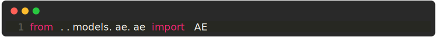
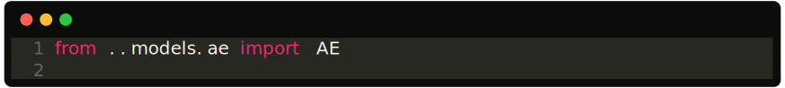

# 🧉 Maté

The root of a mate project is where you can find the `mate.json`. Mate will generate this file for you when you do `mate init`.

---

## File structure of a mate project

The file structure of a mate project is just a collection of nested python modules (a folder is a python module if it contains a `__init__.py` file, which may be empty). When you do a `mate init` you'll automatically generate a simple mate folder structure.

Typically, a file structure will look something like this:

            
        

And this is how the `mate summary` command displays it:

 

To a mate project, the following rules apply:

- all the `README.md` files are optional but, if present, will be used by the `mate show` command to display a module (with its submodules).
- In each python module, you may only have the following:
- an`__init__.py`
- a readme
- other submodules
No other files/folders are allowed. Inside the leaf modules, on the other hand (ex `models/ae`), everything is permitted except for the following rule.
- Each submodule inside a root module (ex `models/ae`) may not import from other submodules in the mate project, i.e., it has to be isolated.
- Different rules apply to the experiment's files (ex `experiments/ae_cifar.py`). See the experiments section below.

## Experiments

Experiments are written in **restricted python**. Meaning it's python but with some limitations that will keep your mate project tidy. The following statements are not supported in a Mate experiment:

loops
functions
math operations
only one if-elif statement is allowed. To check the command sent to the experiment (usually `train` or `test`).

### Imports
You should only import from the root of a module.

For example, this is not a valid import:

            
        

And this is instead valid:

            
        

### Why these rules?

A mate experiment, although a subset of python, is just a configuration file where you should put all your hyperparameters. It's meant to be where you import all your modules and organize them together to run your experiment. Defining loops and functions here would imply that you can skip organizing your project into modules and do everything in this file, thus losing all the attractive properties you get from modularity.

If you're tempted to write functions or loops, maybe you should create a new module.

Below you can find an example of a valid mate experiment:

            
        

