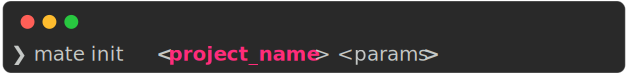
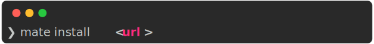
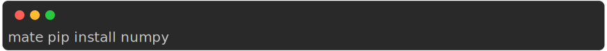
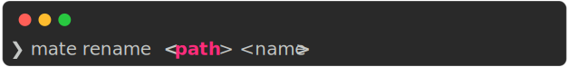
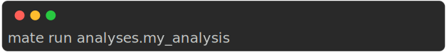

# Mate CLI

The following commands work within a mate project folder, that is, where the `mate.json` file is located. This file will be generated by the `init` command (see below).

 --- 

## Cli Parser

Mate's cli parser is a simple parser that parses the command line arguments and calls the appropriate method on the Mate class.

Notice that for boolean arguments, you can use either false or False, true or True. And for None you can use either null or None.

**Example**

    

 --- 

    

**Params**

- source_model : `str` :  Path to the source model
- target_model : `str` :  Path to the target model

Clones a module

---

    

**Params**

- path : `str` :  Path to the module to create (relative to the project folder)

Creates a new module
The path respects the python format, (e.g. `my_module.sub_module`).

---

    

**Params**

- source : `str` :  Path to the object to export

Exports a function/class from a module

---

    

**Params**

- project_name : `str` :  Name of the project
- params : `str` :  Parameters to pass to the project. These are the same key-value pairs that are in the `mate.json` file (check out that section).

Creates a new mate project in the current folder.

**Example**

    

---

    

**Params**

- path : `str` :  Path to the module to inspect

Provides information about a module, such as:

- exported functions, classes
- imported modules in the case of experiments/analyses
- errors found by mate

**Example**

    

---

    

**Params**

- url : `str` :  URL to the package to install

Installs a module from url. The URL must be a git repository and point to the full path of the module.

---

    

**Params**

Prints the markdown documentation of the project

---

    

**Params**

- commands : `str` :

Executes inside the python venv

    

---

    

**Params**

- target : `str` :  Path to the module to remove

Removes a module

---

    

**Params**

- path : `str` :  Path to the module to rename
- name : `str` :  New name of the module

Renames a module.

---

    

**Params**

- svg : `bool` : =False

Prints results

---

    

**Params**

- target : `str` :  Name of the experiment to run
- command : `Optional` :  Command to run=None

Runs an experiment or analysis. By default, mate assumes that you want to run an expriment.

**Examples**

    

is equivalent to

    

Alternatively, you can run an analysis:

    

---

    

**Params**

- path : `str` :  Path to the module to show

Shows information about a module or experiment.

---

    

**Params**

- svg : `bool` :  Export result as svg=False

Prints a summary of the mate project.

---

    

**Params**

- command : `str` :  Command to run in the virtual environment

Executes inside the python venv

---