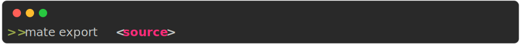

# Mate CLI

The following commands work within a mate project folder, that is, where the `mate.json` file is located. This file will be generated by the `init` command (see below).

 --- 

## Cli Parser

Mate's cli parser is a simple parser that parses the command line arguments and calls the appropriate method on the Mate class.

Notice that for boolean arguments, you can use either false or False, true or True. And for None you can use either null or None.

**Example**

<p align="center" style="">
    
</p>


 --- 

<p align="center" style="">
    
</p>

**Params**

- source_model : `str` :  Path to the source model
- target_model : `str` :  Path to the target model


    Clones a module
    
---

<p align="center" style="">
    
</p>

**Params**

- path : `str` :  Path to the module to create
- name : `str` :  Name of the module to create


    Creates a new module
    
---

<p align="center" style="">
    
</p>

**Params**

- source : `str` :  Path to the object to export


    Exports a function/class from a module
    
---

<p align="center" style="">
    
</p>

**Params**

- project_name : `str` :  Name of the project
- params : `str` :  Parameters to pass to the project. These are the same key-value pairs that are in the `mate.json` file (check out that section).


    Creates a new mate project in the current folder.

    **Example**

    ```
    mate init my_fancy_project venv=false
    ```
    
---

<p align="center" style="">
    
</p>

**Params**

- url : `str` :  URL to the package to install


    Installs a module from url. The URL must be a git repository and point to the full path of the module.

    
---

<p align="center" style="">
    
</p>

**Params**


    Prints the markdown documentation of the project
    
---

<p align="center" style="">
    
</p>

**Params**

- commands : `str` :


    Executes inside the python venv

    ```
    mate pip install numpy
    ```
    
---

<p align="center" style="">
    
</p>

**Params**

- target : `str` :  Path to the module to remove


    Removes a module
    
---

<p align="center" style="">
    
</p>

**Params**

- path : `str` :  Path to the module to rename
- name : `str` :  New name of the module


    Renames a module.
    
---

<p align="center" style="">
    
</p>

**Params**


    Prints results
    
---

<p align="center" style="">
    
</p>

**Params**

- experiment_name : `str` :  Name of the experiment to run
- command : `str` :  Command to run


    Runs an experiment with the given command
    
---

<p align="center" style="">
    
</p>

**Params**

- path : `str` :  Path to the module to show


    Shows information about a module or experiment.
    
---

<p align="center" style="">
    
</p>

**Params**

- svg : `bool` :  Export result as svg=False


    Prints a summary of the mate project.
    
---

<p align="center" style="">
    
</p>

**Params**

- command : `str` :  Command to run in the virtual environment


    Executes inside the python venv
    
---