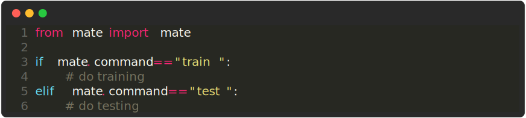
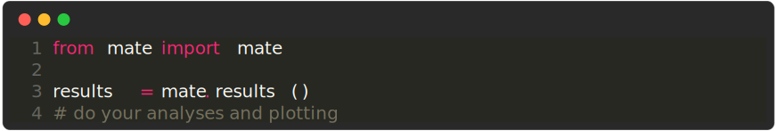

# Mate Runtime

Class containing all the information about the current run. You usually want to import it into your experiment like this:

    

You can use this to:
- Get the current CLI command
- Save the run to a JSON file
- Get the current save directory
- Get the current checkpoint path

**Example**

    

 --- 

### `mate.result(values: dict) -> None`

Save the results of the current run.

**Example**

    

This is not meant to replace a proper logging framework,
but rather to provide a simple way to save the results of an experiment.
This is especially useful when you want to compare multiple experiments (see `mate.results()`).

**Pytorch Lightning Example**

If you want, with pytorch lightning, you can directly pass the `logged_metrics` dictionary to this function.

    

 --- 

### `mate.results() -> dict[str, dict[str, float]]`

Get the results of all experiments. in the form of a dictionary.
The dictionary is structured as follows:

    

    

 --- 