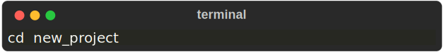
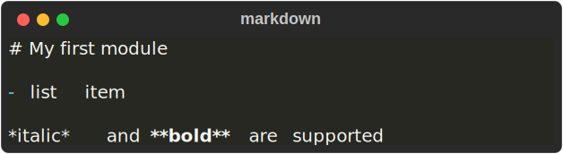

# Mate project from scratch

This is a step by step guide to create a new project from scratch.

## 1 Create a new project
Make sure you're inside a **git** repository and run the following command:

    

This will do the following:

- Create a new folder called `new_project`, with inside the default folder structure
- Create a virtual environment. This will be used to install all the dependencies

To make sure everything worked, first navigate inside the `new_project` folder:

    

Then run:

    

## 2 Creating your first module

Make sure you're still inside the `new_project` folder and run the following command:

    

Now run again:

    

    

You may have noticed a ❌ next to our new module. This is because the module is not exporting anything.

So let's add some code to our module. Create a new file `models/my_module/main.py` (can be called anything) with your favorite editor and add the following:

    

Then export the function to the `__init__.py` file by running:

    

If we now run `mate summary`:

    

We see that the cross has been replaced by a green checkmark. This is because now our module is exporting something. 

To check what's being exported by a module, we can use the `mate inspect` command:

    

    

## 3 Create your first experiment

Now let's create an experiment. Run the following command:

    

Then edit the file `experiments/my_experiment.py`

    

## 4 Run your experiment

Now let's run the experiment. Run the following command:

    

    

You should see `Training a model` printed in the console.
Also notice a 💪 next to the experiment. This means that mate has correctly saved its results.

Hurrah! You just created your first project with mate!

## 5 (Optional) Adding descriptions to your modules and experiments

If you want, you can add descriptions to your modules and experiments in markdown format. This will make it easier to understand what they do.

To add a description to a module, create a file `models/my_module/README.md` with your favorite editor and add the following:

    

To add a description to an experiment, you must edit the experiment's docstring.

    

To see the description of a module or experiment, run:

    

    

    

    

