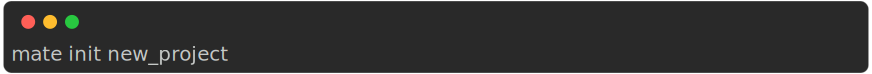
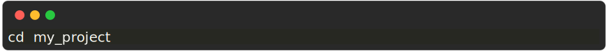
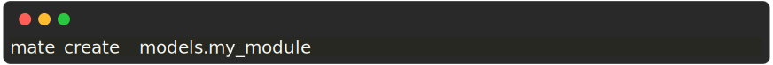
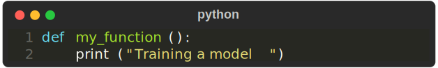
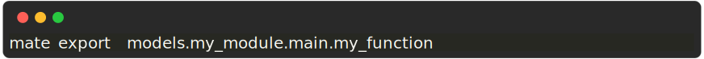
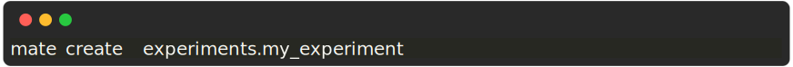

# Mate project from scratch

This is a step by step guide to create a new project from scratch.

## 1 Create a new project
Make sure you're inside a **git** repository and run the following command:

    

This will do the following:

- Create a new folder called `new_project`, with inside the default folder structure
- Create a virtual environment. This will be used to install all the dependencies

To make sure everything worked, first navigate inside the `new_project` folder:

    

Then run:

    

## 2 Create a your first module

Make sure you're still inside the `new_project` folder and run the following command:

    

Now run again:

    

Now let's add some code to our module. Create a new file `models/my_module/main.py` with your favorite editor and add the following code:

    

Then export the function to the `__init__.py` file by running:

    

## 3 Create your first experiment

Now let's create an experiment. Run the following command:

    

Then edit the file `experiments/my_experiment.py`

    

## 4 Run your experiment

Now let's run the experiment. Run the following command:

    

You should see `Training a model` printed in the console.
Hurrah! You just created your first project with mate!